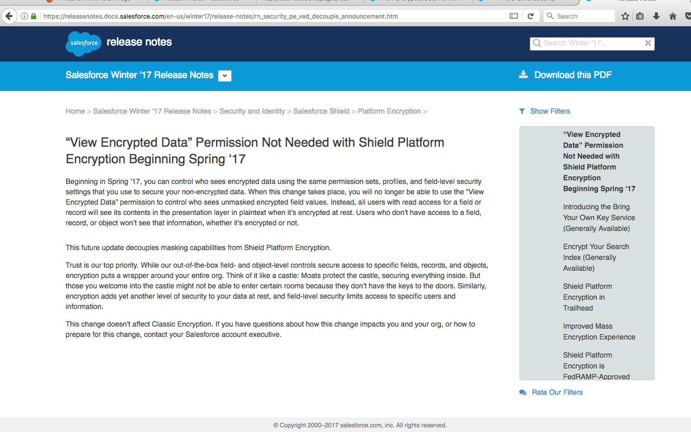
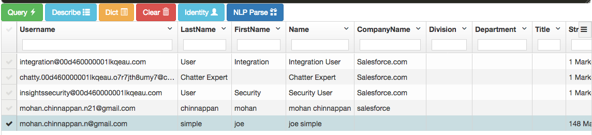
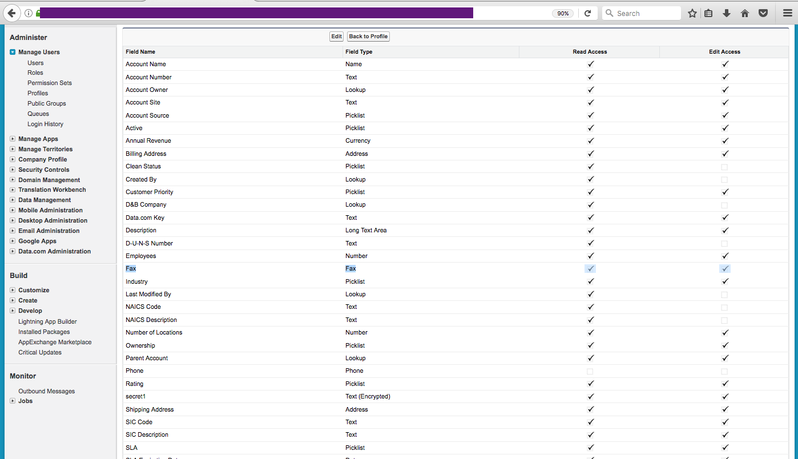
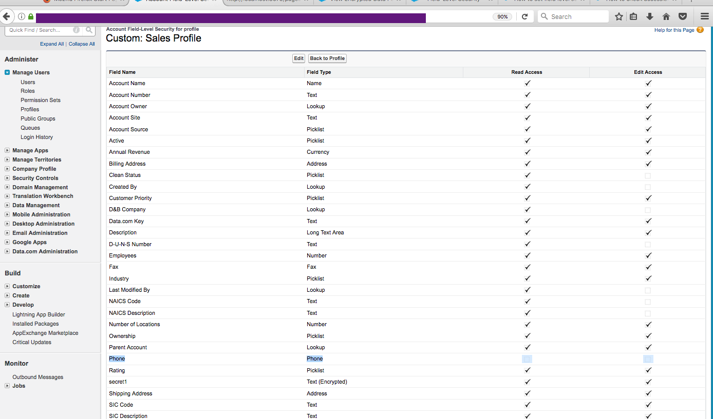
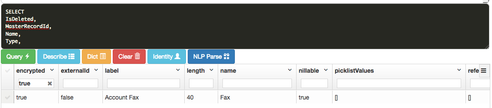
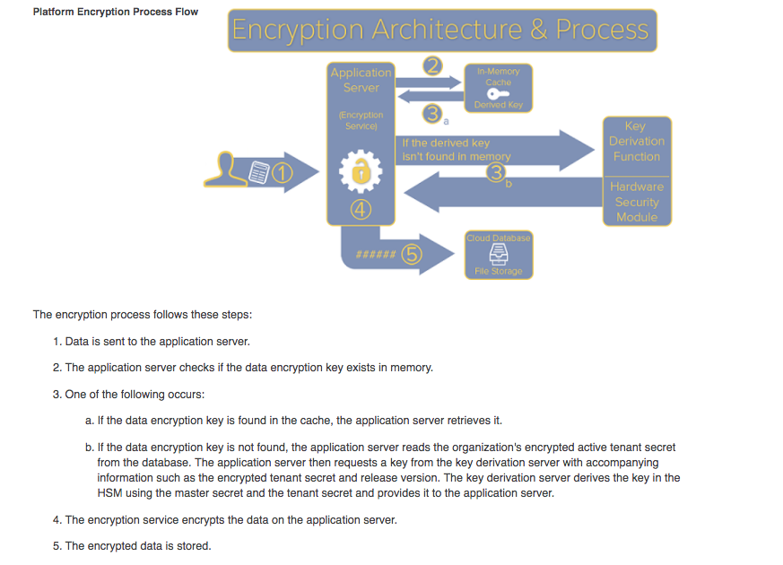

# FAQ - Shield Platform Encryption


 1.How do I know a Field in an Object is encrypted at rest?
 --------------------------------------------------------

Metadata API - ***describe*** - provides **encrypted** flag value for the encrypted fields as **true** as shown below:

#### Account object encrypted fields:


#### Describe on Account Object showing **encrypted flag** for the  encrypted fields:


#### Describe on Account Object:


### Options for Verifying Encryption:

1. At the request of an organizations admin,  ***Tier 3 security agents*** can run a backend process to provide confirmation details of encrypted fields based on server logs which can be provided to users. Please allow two business days for these requests to process due to complexity of the request.

2. Organization admins can follow the steps below to use **tenant key masking** to verify field encryption at a record level:


      a.     Export **current tenant secret** used to encrypt current data in report and store it in a safe place.

      b.     Generate a **new tenant secret**.

      c.     Destroy the initial key used to encrypt data.

      d.     With the new key active navigate to any record where fields are encrypted and the data will show ????? meaning the data is encrypted.


Note: Once the admin or customer has reviewed the data masked with ????, the old secret used to encrypt the data can be imported back into the org and the new key destroyed as it was not used to encrypt any data.


#### How about Attachments encryption?

In the event that an admin would like to verify encryption on files and attachments the query below can be ran in Developer Console:

 ```sql
     SELECT ContentType, Id, IsEncrypted FROM Attachments WHERE IsEncrypted = false/true
```

The query above will run against attachments and show all content where IsEncrypted = true or false. The attachments option can be replaced with files and content type removed to determine if files are encrypted or decrypted based on the IsEncrypted flag.

For additional information related to platform encryption masking please review our Salesforce article entitled:

 What Does My Encrypted Data Look Like?:
  https://help.salesforce.com/articleView?id=security_pe_masking.htm&type=0


<hr/>

2.Knowledge Article: 000247422 says: View Encrypted Data Permission Not Needed with Shield Platform Encryption Beginning Spring ‘17
---------------------------------------------------------------------------------------------------------------------------------
Can you explain this with an example?
-------------------------------------


[Reference to this Knowledge Article](https://help.salesforce.com/articleView?id=000247422&type=1)





[Reference: View Encrypted Data” Permission Not Needed with Shield Platform Encryption Beginning Spring ‘17](https://releasenotes.docs.salesforce.com/en-us/winter17/release-notes/rn_security_pe_ved_decouple_announcement.htm)


Let us take an example: In our org, we have an user: **joe simple**




Joe can see the **encrypted** field: **Account.Fax** but Joe **can't** see the **encrypted** field **Account.Phone** as per FLS for his profile:

#### Account.Fax:



#### Account.Phone:



If Joe uses REST API for example, to access Account Object, Joe will be denied access to the field: **Account.Phone** as shown below, while Joe can access **Account.Fax**



But other user, whose FLS allows **read** on these fields: **Account.Fax** and **Account.Phone** can access these two fields:


<hr/>


3.Do I have to backup tenant secrets?
--------------------------------------------------------

YES!!!

Tenant secrets are not like passwords.

Unlike passwords, you can’t reset a tenant secret. Salesforce can’t help with deleted, destroyed, or misplaced tenant secrets. Always back up tenant secrets!

<hr/>

4.Is the encrypted fields data encrypted at rest?
--------------------------------------------------------

YES!

You should use field-level access controls to limit who can access this sensitive data as shown above in question number: 2

<hr/>

5.About guideline for selecting fields for encrypting?
--------------------------------------------------------

Unnecessarily encrypting data can slow down performance and affect users day-to-day activities.  Based on your regulatory requirements define the kinds of customer data that require extra security and apply Shield Platform Encryption only to those areas.


6.About automatic encryption?
---------------------------------

Field values are automatically encrypted only in records **created or updated after you’ve enabled encryption**. Salesforce recommends **updating existing records** to ensure that their field values are encrypted. For example, if you encrypt the Description field on the Case object, use the Data Loader to update all case records. Contact Salesforce if you need help with this.


7.Can you provide technical details about Platform Encryption?
----------------------------------------------------------------




 Here is the video answering this question. Click on the image below to view the video:

[](https://www.yout‌​ube.com/watch?v=RMUl0fF7x1E "Salesforce Shield Platform Encryption Whiteboard")


<hr/>
<hr/>

### Links for curious minds:


What’s the Difference Between Classic Encryption and Shield Platform Encryption?:
https://help.salesforce.com/articleView?err=1&id=security_pe_comparison_table.htm&siteLang=en_US&type=0

How Shield Platform Encryption Works:
https://help.salesforce.com/articleView?id=security_pe_concepts.htm&type=0&language=en_US

Tradeoffs and Limitations of Shield Platform Encryption:
https://help.salesforce.com/articleView?err=1&id=security_pe_considerations.htm&siteLang=en_US&type=0

Encrypt Fields:
https://help.salesforce.com/articleView?err=1&id=security_pe_enable_standard_fields.htm&siteLang=en_US&type=0&language=en_US


Salesforce Shield Platform Encryption Whiteboard:
https://www.youtube.com/watch?v=RMUl0fF7x1E


View Encrypted Data Permission Not Needed with Shield Platform Encryption Beginning Spring ‘17:


https://help.salesforce.com/articleView?id=000247422&type=1


View Encrypted Data” Permission Not Needed with Shield Platform Encryption Beginning Spring ‘17:
https://releasenotes.docs.salesforce.com/en-us/winter17/release-notes/rn_security_pe_ved_decouple_announcement.htm


Platform Encryption Best Practices:
https://developer.salesforce.com/docs/atlas.en-us.securityImplGuide.meta/securityImplGuide/security_pe_best_practices.htm

SALESFORCE PLATFORM ENCRYPTION:
https://resources.docs.salesforce.com/206/latest/en-us/sfdc/pdf/salesforce_platform_encryption_tipsheet.pdf

Training: Trailhead: Shield Platform Encryption:
https://github.com/mohan-chinnappan-n/Shield-setup/blob/master/FAQ/faq.md


Tighten Your Security with Salesforce Shield Platform Encryption:
https://www.youtube.com/watch?v=sZ9SvYIij4w
