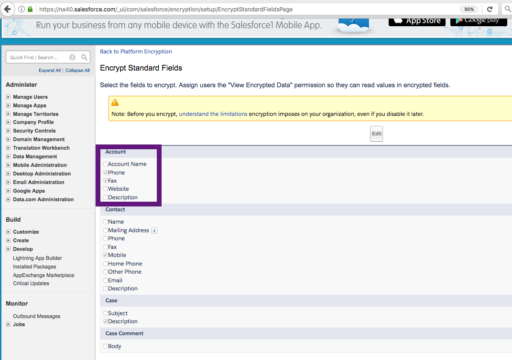
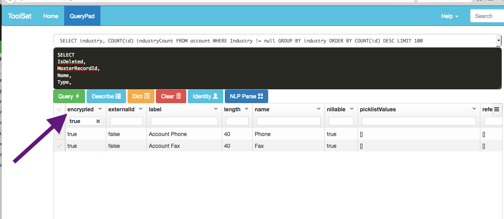
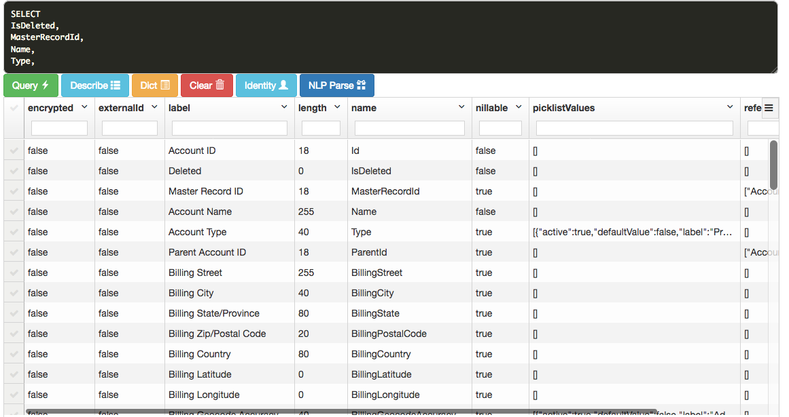
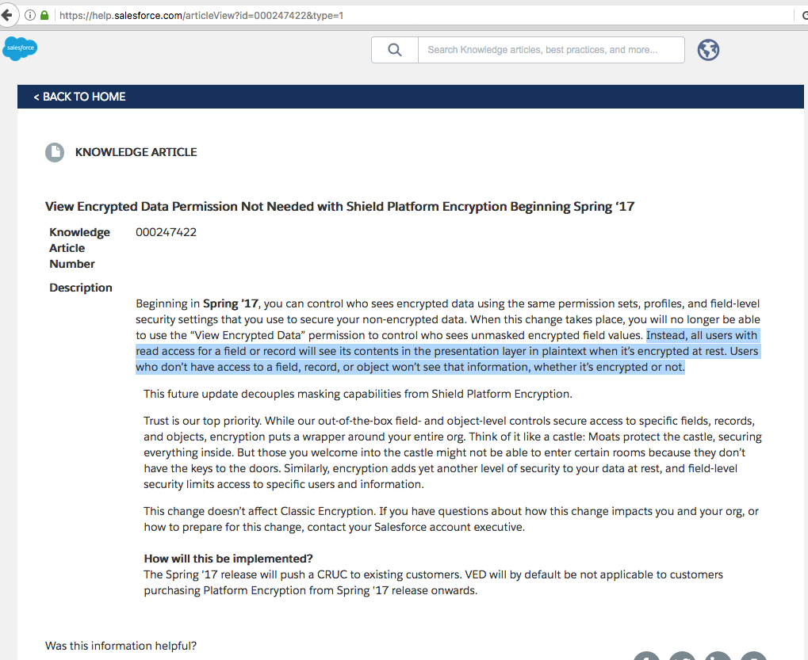

# FAQ - Shield

 1.How do I know a Field in an Object is encrypted at rest?
 --------------------------------------------------------

Metadata API - ***describe*** - provides **encrypted** flag for this encrypted field as **true** as shown below:

#### Account object encrypted fields:

#### Describe on Account Object showing encrypted fields:

#### Describe on Account Object:

2. Knowledge Article: 000247422 says: View Encrypted Data Permission Not Needed with Shield Platform Encryption Beginning Spring ‘17
---------------------------------------------------------------------------------------------------------------------------------
Can you explain this with an example?
-------------------------------------

[Reference to this Knowledge Article](https://help.salesforce.com/articleView?id=000247422&type=1)

[View Encrypted Data” Permission Not Needed with Shield Platform Encryption Beginning Spring ‘17]
(https://releasenotes.docs.salesforce.com/en-us/winter17/release-notes/rn_security_pe_ved_decouple_announcement.htm)
